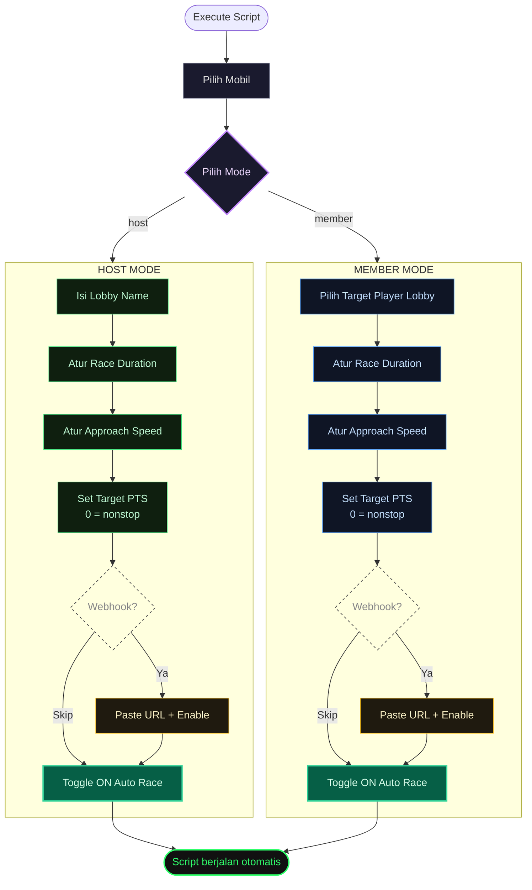

```mermaid
flowchart TD
    A(["Execute Script"]) --> B["Pilih Mobil"]:::step
    B --> C{"Pilih Mode"}:::decision

    C -->|host| HOST
    C -->|member| MEMBER

    subgraph HOST ["HOST MODE"]
        direction TB
        H1["Isi Lobby Name"]:::host
        H1 --> H2["Atur Race Duration"]:::host
        H2 --> H3["Atur Approach Speed"]:::host
        H3 --> H4["Set Target PTS\n0 = nonstop"]:::host
        H4 --> H5{"Webhook?"}:::opt
        H5 -->|Ya| H6["Paste URL + Enable"]:::optional
        H5 -->|Skip| H7
        H6 --> H7["Toggle ON Auto Race"]:::go
    end

    subgraph MEMBER ["MEMBER MODE"]
        direction TB
        M1["Pilih Target Player Lobby"]:::member
        M1 --> M2["Atur Race Duration"]:::member
        M2 --> M3["Atur Approach Speed"]:::member
        M3 --> M4["Set Target PTS\n0 = nonstop"]:::member
        M4 --> M5{"Webhook?"}:::opt
        M5 -->|Ya| M6["Paste URL + Enable"]:::optional
        M5 -->|Skip| M7
        M6 --> M7["Toggle ON Auto Race"]:::go
    end

    H7 --> DONE(["Script berjalan otomatis"]):::done
    M7 --> DONE

    classDef step fill:#1a1a2e,stroke:#8b8fa3,color:#e0e0e0,stroke-width:1px
    classDef decision fill:#1a1a2e,stroke:#c084fc,color:#e9d5ff,stroke-width:2px
    classDef host fill:#0f1f0f,stroke:#4ade80,color:#bbf7d0,stroke-width:1px
    classDef member fill:#0f1525,stroke:#60a5fa,color:#bfdbfe,stroke-width:1px
    classDef opt fill:none,stroke:#444,color:#888,stroke-dasharray:4
    classDef optional fill:#1f1a0f,stroke:#fbbf24,color:#fef3c7,stroke-width:1px
    classDef go fill:#065f46,stroke:#34d399,color:#d1fae5,stroke-width:2px
    classDef done fill:#111,stroke:#30ff6a,color:#30ff6a,stroke-width:2px
```
